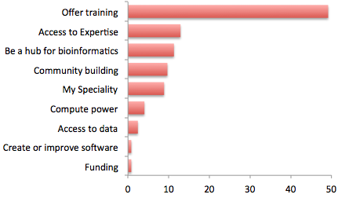
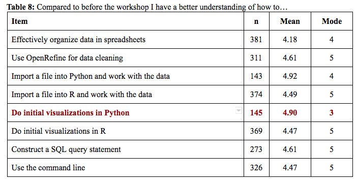
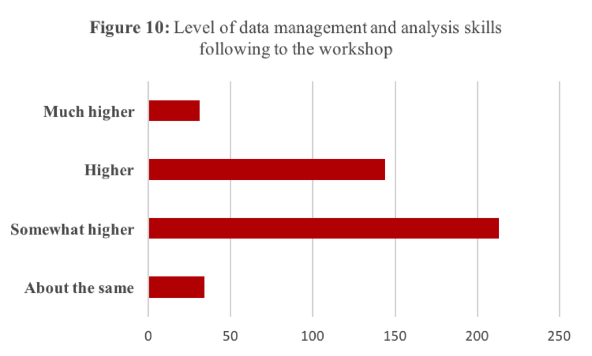
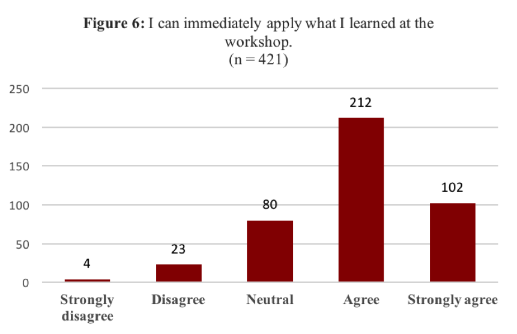
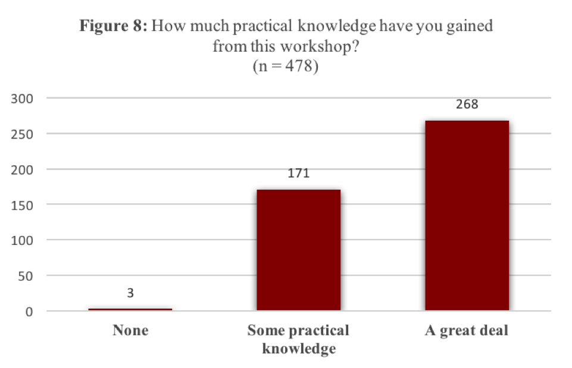
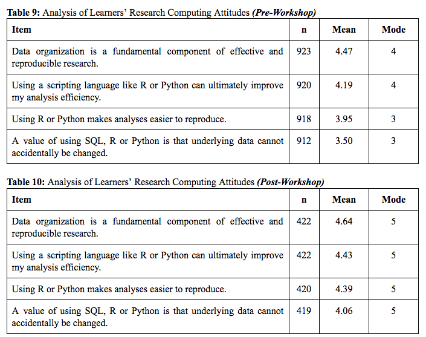
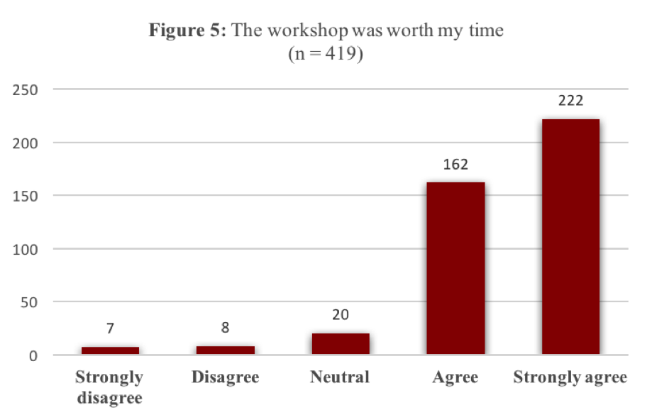
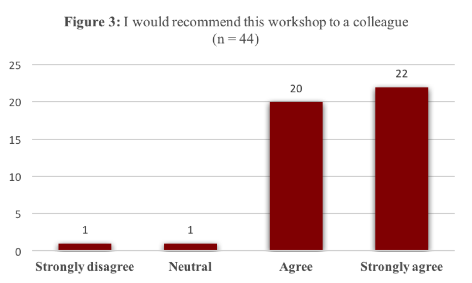

---

## Learning Objectives

* Learning best practices for recording and formatting data in spreadsheets
* Understanding the correspondence between columns and rows in spreadsheets 
and data structure
* Understanding the correspondence between spreadsheet cells, columns and rows 
and data observations and values

Data production is no longer the bottleneck.

We can collect and analyze data that gives us information and
insight in a way we never could before. It opens up possibilities
for the types of work we can do and questions we can ask. 

---

But with the opportunity to collect data there comes challenges
and frustrations. That's part of why we're here today, to present and learn from each other how people are addressing the challenges.

---

## {.flexbox .vcenter}

Software and tools allow us to turn data into information.

We put a lot of emphasis on the development of tools and approaches, and rightfully so. These tools help us get to the 'now what' and turn data into information. Grants and VCs support this work
that give us a new view of the data or a way to use it. 

## {.flexbox .vcenter} 

People turn information into knowledge.

It is not the tools that do the work to turn data into knowledge
or make the discoveries. People are the ones who turn information 
into knowledge. 

## {.flexbox .vcenter} 

By making data accessible and putting the data skills and the perspectives in the hands of all researchers, we allow them to answer their own questions and capture their passion and expert knowledge.

When we limit the number or types of people who
do this work, we're losing that curiousity, that drive, that
expert knowledge.

Story about person. Who better to do or be a part of the analysis
of the ... gemone than the person who has spent their entire 
career working on it. If they hand it to me, I'm not as movitated,
 and I might not even get it right.
 

# Unleash the potential of data by empowering people

Data and people can reach their full potential when 
we give more people the skills and perspective to 
work effectively with data.

It's more than the skills, and also the perspective
to understand what's possible with data. How it's stored, how
we can access it, the types of outcomes we can see. It's often
difficult to understand what you can do, without knowing what's possible.

# How do we scale data skills and literacy along with data production?

## Researchers want these skills

Most useful thing Bioinformatics Resource Australia can do

[BRAEMBL community survey report](http://braembl.org.au/news/braembl-community-survey-report-2013)

## Training in the Gaps: Active researchers

Active researchers and employees are learning these skills "on the job".

Need to develop and deliver training that fits their time and needs.

> - Training that is immediate, accessible, appropriate for their level and relevant to their domain.
> - Include not only technical skills, but also ways of thinking about data and knowing what's possible
> - Opportunity for deliberate practice, hands-on training with feedback during learning
> - Researchers need to build confidence and the belief that they are capable of computational work, self-efficacy

No time or focus for semester courses or even MOOCs

Need to develop and deliver training that fits in their time and attention.

- Researchers need training that is immediate, accessible, appropriate for their level and relevant to their domain.
- Training needs to include not only technical skills, but also ways of thinking about data and knowing what's possible
- Learning is improved through deliberate practice, hands-on training with feedback during learning
- Researchers need to build confidence and the belief that they are capable of computational work, self-efficacy

## {.flexbox .vcenter} 

## Data Carpentry

Data Carpentry teaches domain-specific two-day, **hands-on workshops** on the foundational concepts, skills and tools for working more effectively with data. 

No prior computational experience is required to attend workshops.

Workshops are taught by trained volunteer instrductors. 

Lesson materials are collaboratively and openly developed. 

### Workshop goals

- Teach skills

- Build confidence

- Change perspectives

## What we teach

Focused on data - teaches how to manage and analyze data in an effective and reproducible way.

### Biology

- Data organization with spreadsheets
- OpenRefine for data cleaning
- SQL for data management
- R or Python for data analysis and visualization

Genomic and Geospatial data lessons cover topics relevant to those data types. Working on social sciences, library and image analysis.

## How we teach: Hands on intensive workshops

- Short: Two days
- Impactful: Focused time
- Convenient: Held at the university or organization
- Interactive: Hands-on teaching and exercises
- Immediate feedback: sticky notes & minute cards
- Qualified instructors
- Shared learning and a friendly learning environment

- Short: Two days
- Impactful: Focused time
- Convenient: Held at the university or organization
- Interactive: Hands-on teaching and exercises
- Immediate feedback: sticky notes & minute cards
- Qualified instructors
- Shared learning and a friendly learning environment

## Instructors

## Outcomes

- Learner outcomes
- Instructor outcomes
- Community!

## Workshop goals

- Teach skills

- Build confidence

- Change perspectives 

## Increased skill levels reported

# {.centered}

## Increased confidence in ability to use skills

## Change in perspective about use of skills for reproducible research

# {.centered}

# {.centered}

# {.centered}

## Instructor outcomes

- People learn new technical skills
- They have a community - no more 'lone informatician'
- People become better communicators
- Gain value from giving back and empowering people with the skills they have learned are valuable

## Community!

An active and engaged community of instructors and learners, both using
and advocating for best practices in effective and reproducible research

Survey question about strongly agree that you would recommend to a friend

## {.centered}

- Active researchers and employees are very motivated, but need 'on the job' training
- Training for active researchers needs to teach in the gaps
- Workshops and curriculum like Data Carpentry can get researchers started learning, learn skills immediately relevant to their work and build confidence

## How can you or your organization be involved

- Request a workshop
- Become a Partner and build local training capacity
- Become an instructor or help at a workshop
- Contribute to lessons
- Join our 'announce' list to be a part of the community
- Be an advocate for training initiatives & opportunities

## Acknowledgements

- Over 700 volunteers worldwide that teach and develop lessons
- Greg Wilson, who founded Software Carpentry
- The Steering Committees of Software and Data Carpentry (Karthik Ram and Ethan White)
- Software and Data Carpentry staff: Jonah Duckles, Greg Wilson, Erin Becker, Maneesha Sane and Kari Jordan

## Acknowledgements
- Gordon and Betty Moore Foundation
- National Science Foundation BIO Centers: iDigBio, CyVerse, NESCent, SESYNC, BEACON, NEON

